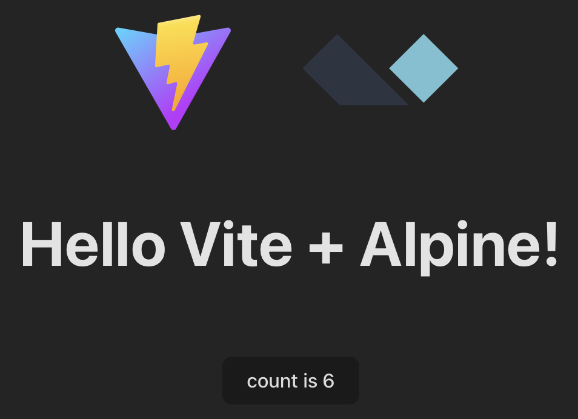

# vite-alpine

This is another [vite template](https://vitejs.dev/guide/#trying-vite-online) based on the vanilla template with added [alpinejs](https://alpinejs.dev/)

[](https://dvd101x.github.io/vite-alpine)

Test this template in [github-pages](https://dvd101x.github.io/vite-alpine)

# to start

Run the following commands

Install dependencies once:
```
npm install
```
Start dev server
```
npm run dev
```

Build a bundle (generated in the dist folder):
```
npm run dist
```

# how was this made?

1. Follow the steps to create a `vanilla` project 
  https://vitejs.dev/guide/#scaffolding-your-first-vite-project 
2. Follow the steps to install alpinejs as a module
  https://alpinejs.dev/essentials/installation#as-a-module
3. Modify the project to use Alpine instead of vanilla javascript.
